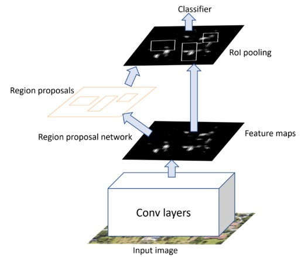

- [1. introduction](#1-introduction)
- [2. Architecture of Faster R-CNN](#2-architecture-of-faster-r-cnn)
  - [2.1 Backbone Network](#21-backbone-network)
  - [2.2 RPN](#22-rpn)
    - [2.2.1 Architecture](#221-architecture)
    - [2.2.2 Anchors](#222-anchors)
    - [2.2.3 Training](#223-training)
    - [2.2.4 NMS](#224-nms)
  - [2.3 ROI Pooling](#23-roi-pooling)
  - [2.4 Classifier and Regression heads](#24-classifier-and-regression-heads)
- [3. Training Process](#3-training-process)
  - [Loss Function](#loss-function)
- [reference](#reference)

# 1. introduction
**Faster R-CNN** is the third generation of R-CNN family. The character of **Faster R-CNN** is that instead of using a selective search algorithm, a **region proposal network (RPN)** is used to predict the region proposals as part of the training process. 

# 2. Architecture of Faster R-CNN


There are 4 main components for Faster R-CNN:
* **Backbone Network**: act as the feature extractor. It is usually the pre-trained ConvNet (e.g VGG, ResNet). This network intake entire input image and output feature maps.
* **Region Proposal Network (RPN)**: intakes feature maps from <u>backbone network</u> and output region proposals in multiple size. The process of generating region proposals is by sliding a small network over the feature map.
* **ROI pool**: intakes both feature maps from <u>backbone network</u> and region proposals from <u>RPN</u>. it outputs fixed size feature maps.
* **Classification and Bounding Box Regression Heads**: comprised of two parallel fully connected layers:
  - **Classification head**: predicts the class of the object in each ROI 
  - **Bounding box regression head**: refine the coordinates of the detected object

## 2.1 Backbone Network
It is a pretrained CNN with classification layer removed. The purpose is to extract features from the input image. 

## 2.2 RPN
RPN itself is a trainable **fully convolutional neural network** that predicts two things:
1. **Objectness Score**: The probability that the region contains an object versus background.
2. **Bounding box regression offsets**: Adjustments to fine-tune the coordinates of the proposed bounding boxes.

### 2.2.1 Architecture
RPN consists of two layers:
1. **Shared Convolution Layer**: (3x3 Conv with 512 output channels), works as sliding window over the feature maps from <u>backbone network</u>. This layer generate ```k``` anchors for each spatial location (center) of sliding window. The ```k```  anchors are different in terms of scale and aspect ratio (pre-fixed) to cover a wide variety of objects.
2.  **Two Parallel Output Layers**:
    1. **Objectness Score Layer**: (1x1 Conv with 2`k` output channels), probability for each anchor that contains an object (<u>background</u> or <u>foreground</u>)
    2. **Bounding Box Regression Layer**: (1x1 Conv with 4`k` output channels), offsets (dx, dy, dw, dh) for each anchor to refine its coordinates
   
### 2.2.2 Anchors
Anchors are the reference bounding boxes for <u>two parallel output layers</u> to predict. Anchors are predefined of different scales and aspect ratios (use `k` to represent the number anchors per each spatil location).

We ask <u>Bounding Box Regression Layer</u> to predict the offset of bounding boxes instead of coordinates and sizes of the bounding boxes. 

Finally, each Anchors would have 2`k` (objectness scores) + 4`k` (bounding box offsets) = 6`k` bounding boxes.

### 2.2.3 Training 
The loss for RPN consists of two components : 1) **classification loss**, 2) **regression loss**

(todo: the formula)

### 2.2.4 NMS
Since anchors usually overlap, proposals end up also overlapping over the same object. To solve the issue of duplicate proposals we use NMS. NMS takes the list of proposals sorted by score, then NMS iterates over the sorted list, discarding those proposals that have **IoU** larger than predefined threshold.

After applying NMS, the top N proposals (N=2000) would be subjected to next step (ROI pooling)

## 2.3 ROI Pooling

## 2.4 Classifier and Regression heads

# 3. Training Process

## Loss Function


# reference
1. https://viso.ai/deep-learning/faster-r-cnn-2/
2. https://pyimagesearch.com/2023/11/13/faster-r-cnns/
3. https://tryolabs.com/blog/2018/01/18/faster-r-cnn-down-the-rabbit-hole-of-modern-object-detection
4. https://blog.csdn.net/qq_27825451/article/details/88843333