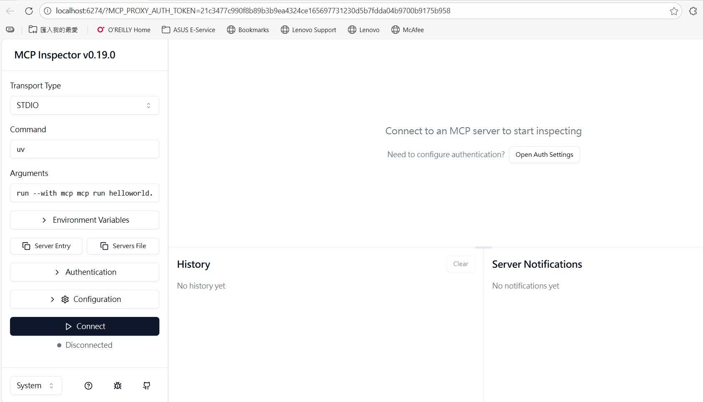
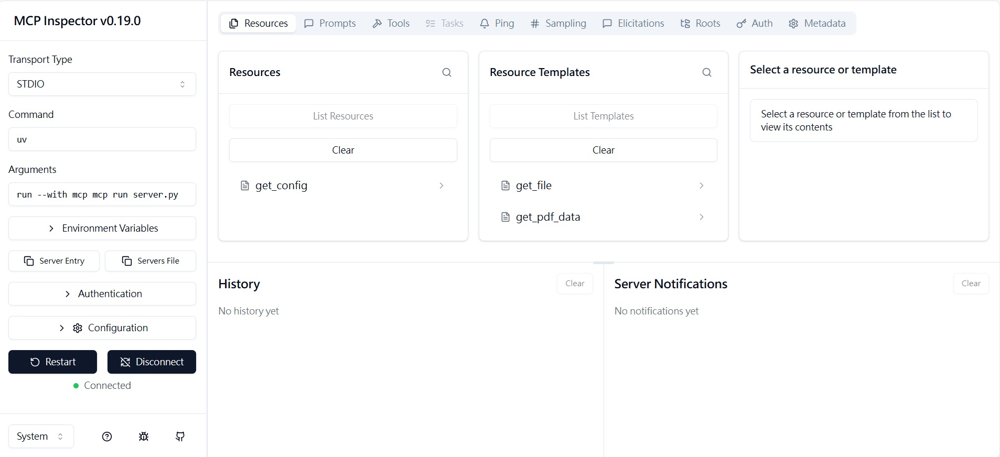
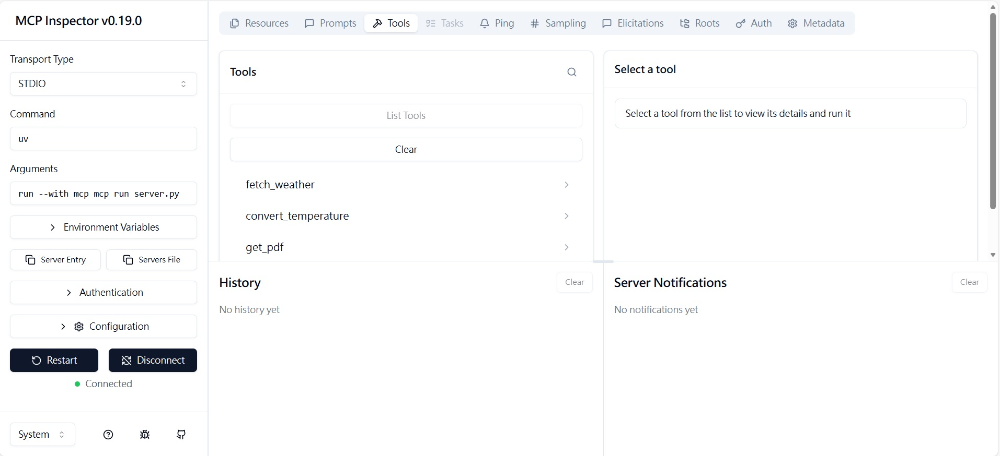
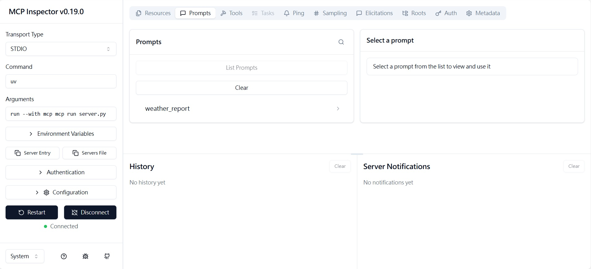

# 1. Reference
1. Hugging Face in Action, Chapter 13

# 2. Introduction
We are going to build an **MCP Server** using Python. We will mainly use `mcp` package to build the MCP server.

# 3. Steps

## 3.1 Initializing project
We will use `uv` to manage Python package. Assume we have installed `uv` on our workstation. We use `uv` to initialize the <i>MCP_Demo</i> project.
```bash
$ uv init MCP_Demo

$ cd MCP_Demo
```

Then we use `uv` to install required package for the project.
```bash
$ uv add "mcp[cli]"
```

## 3.2 Test with Hello World code
We implement the MCP server on `demo.py` file.
<u><i>demo.py</i></u>

```python
from mcp.server.fastmcp import FastMCP

mcp = FastMCP("MCP Demo")

if __name__=="__main__":
    mcp.run(transport='stdio')
```
Then we could run the MCP server by below command.
```bash
$ uv run helloworld.py
```

Usually, we would run the MCP server with **MCP Inspector** to display content on browser. Please run below command.
```bash
$ uv run mcp dev helloworld.py
Starting MCP inspector...
⚙️ Proxy server listening on localhost:6277
🔑 Session token: db28ea92cf601fd63fce20b03d939960bf5eed77d5bde187a22f5326c631929d
   Use this token to authenticate requests or set DANGEROUSLY_OMIT_AUTH=true to disable auth

🚀 MCP Inspector is up and running at:
   http://localhost:6274/?MCP_PROXY_AUTH_TOKEN=db28ea92cf601fd63fce20b03d939960bf5eed77d5bde187a22f5326c631929d
```

Then you will find that **MCP Inspector** is running on browser.



## 3.3 MCP Server with basic features
In the [Section 3.2 MCP Server Structure](../README.md), one **MCP Server** consists of **Tools** & **Resource** & **Prompts**. The `mcp` package provides <i><u>decorators</u></i> to wrap the funtion that we are going to implement.<br>
We are implementing demo **MCP Server** on `mcp_server.py`.

```python
### Resource Decorator
@mcp.resource("text://{file_path}")
def get_file(file_path: str) -> str:
    ......

### Tool Decorator
@mcp.tool()
def get_pdf(file_path: str) -> str:    
    return get_pdf_data(file_path)

### Prompt Decorator
@mcp.prompt()
def weather_report(city: str) -> str:
    return f"""
    Please provide a weather report for {city}.

    You can use the fetch_weather tool to get current weather data.
    If needed, you can convert temperature units using the
    convert_temperature tool.

    Please include:
    - Current temperature
    - Weather conditions
    - Humidity
    - Wind speed
    - Any relevant weather advice for the conditions
    """
```

Go to [mcp_server.py](../MCP-Example-Python/mcp_server.py) for full version of **MCP Server**.<br>
We execute below command to start MCP server with MCP inspector.
```bash
$ uv run mcp dev mcp_server.py

```

Click on the `Connect` button. The MCP server would show up *Resources* & *Tools* & *Prompts* tags.<br>
*Resources Tag*

*Tools Tag*

*Prompts Tag*
