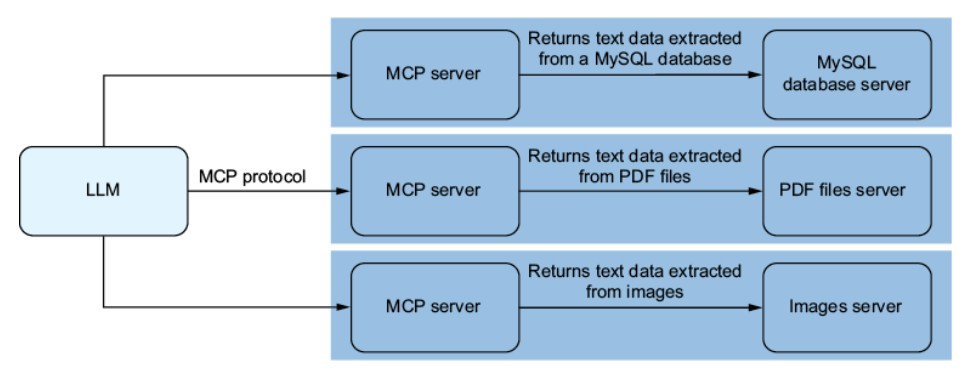
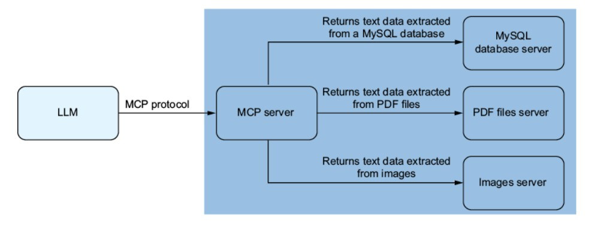

# 1. References
1. Hugging Face in Action, Chapter 13

# 2. Introduction
**Model Context Protocol (MCP)** is an open standard created by Anthropic. It is based on `JSON-RPC 2.0` and is designed to let LLMs connect to external services such as filesystems, databases, APIs. MCP removes the special setup for input interface for each external service.

# 3. Structures 
The MCP workflow has three main components:
- **MCP Client** -- Usually an LLM or an AI-powered app
- **MCP Server** -- A server that handles, processes, responses requests. It is the central hub that connects clients to services.
- **Services** -- The actual features or data or tools the client wants to use (e.g. `fetch_weather` or `get_config`)

<i><u>Multiple MCP Server Architecture</u></i> 

<i><u>Single MCP Server Architecture</u></i> 

## 3.1 About MCP Server 
We can deploy MCP server in two ways: 
**Locally** -- Run the MCP server on the same machines as the MCP Client in which they communicate with each other using standard input and output streams. In this approach, the MCP server runs as a separate process on the same machine as the client.
 

**Remotely** -- Run the MCP server on a separate remote machine, with the MCP client accessing it over the network. In this case, the client will use HTTP POST to communicate with server, and the server will response to the client using <b>Server-Sent Events (SSE)</b> which supports multiple clients at the same time.

### 3.1.1 Server-Sent Events (SSE)
**Server-Sent Events (SSE)** is a web standard that enables a server to push real-time data to client over a single HTTP connection. It establishes a persistent connection.
The server can send data to client continuously without client having to poll or make new request server.
 
<b>SSE</b> is like <u>WebSockets</u> but it is undirectional that only the server can send data to client.

## 3.2 MCP Server Structure
**MCP Server** consists of three main components:
- **Tools** -- Represent the actionable capabilities that MCP servers provide to LLMs. They act like a set of specialized functions such as reading files with filesystem tool, querying web with searching tool, generating images with GenAI.
- **Resources** -- Represent the external data or entitles that `Tools` can interact with. They could be local files from filesystem, web pages from web searching tool, image from GenAI.
- **Prompts** -- The predefined templates for LLM interaction.

# 4. Examples of MCP
The example of MCP is available on [MCP Example](MCP-Example-Python/README.md)
