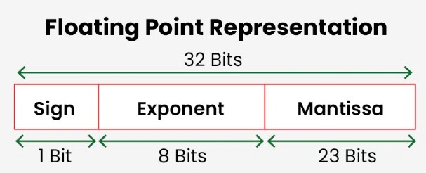
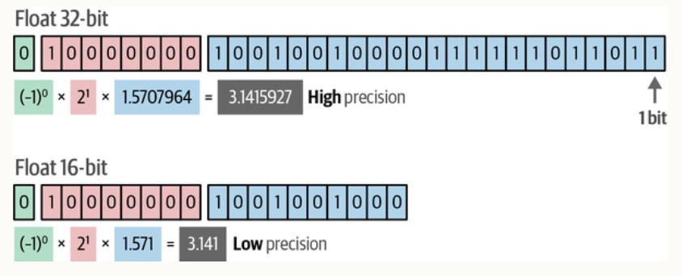
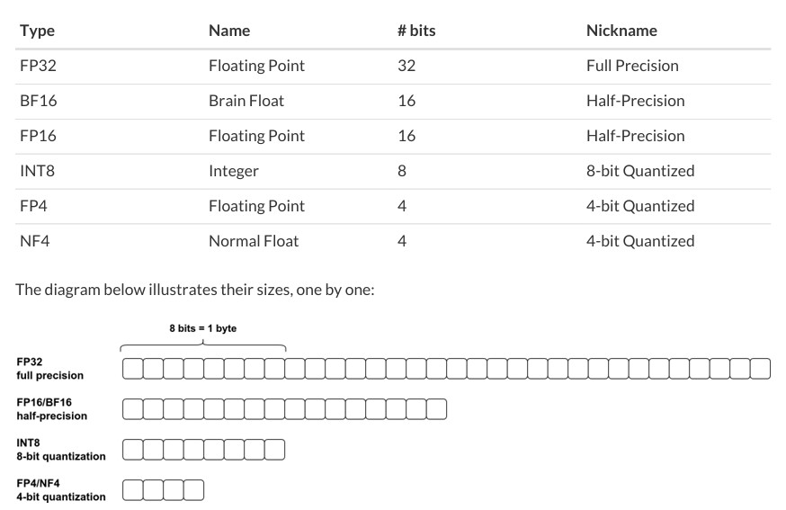

# 1. Introduction

# 2. Study on precision formats
When talking about **quantization**, we cannot avoid talking about floating-point numbers. In floating-point representation, numbers are stored in a combination of three parts:
- sign
- exponent
- mantissa
 

 

The more bits used to represent a number, the higher the precision and the greater the range of values that can be represented. Precision is defined by the number of bits in <u>mantissa</u>, while range is defined by <u>exponent</u>. 

 

## 2.1 Mix Precision Training.
There is slight decrease in precision from using 64-bit floats to 32-bit floats, and no significantly impact the model's predictive performance. However, the story is not the same when from using 32-bit floats to 16-bit floats. 

**Mix precision Training** has been introduced to replace 16-bit training. In mixed precision training of a model, not all the parameters and operations are transferred to 16-bit floats but there are sitches between 32-bit and 16-bit operations during training. 

Mix precision Training involves below steps:
1. converting weights to lower-precision for faster computation, calculating gradients in lower-precision
2. converting gradients back to higher-precision for numercial stability, and finally updating the original weights with the scaled gradients.
 

Comparing mixed precision training to 32-bits training and 16-bits training, the allocated memory for mixed precision training is higher than 16-bits, but still lower than 32-bits. The performance is comparable to 32-bits training. 

There is new floating point format that is **Brain Floating Point (bfloat16)**. It is developed by Google for DL on TPUs. 

Finally, below is the table summarising bits of floating type.

 

# 3. Quantization

hand-on examples on quantization are available on notebook.

## 3.1 Quantization to all layers

## 3.2 Quantization to different granularity levels

## 3.3 Extreme Quantiztion