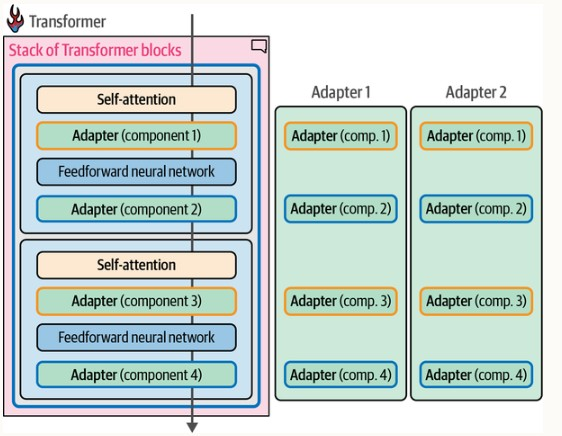
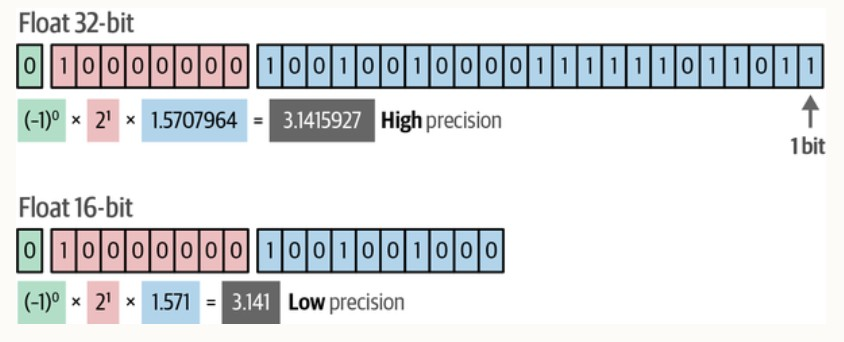
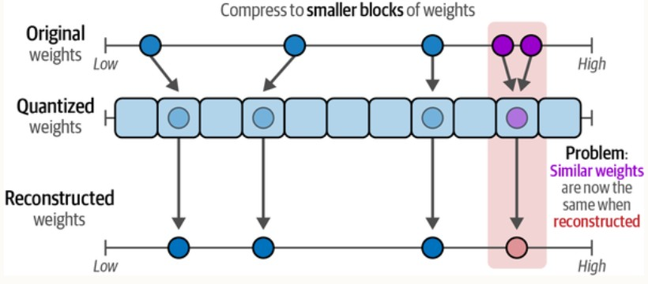
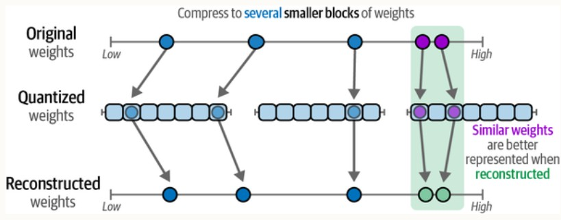
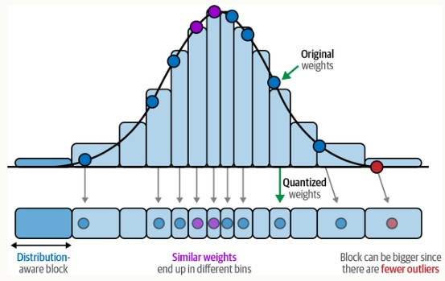
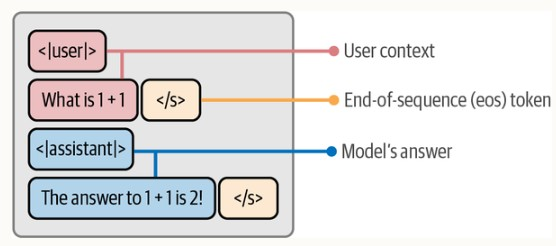

# 1. Introduction
When we are going to fine tuning an Pre-Trained Large Language Model (LLM), we could not skip **Hugging Face**.  
Hugging Face provides a platform for hosting open source pretrained models and datasets. 

## 1.1 Reference Books
1. Hugging Face in action
2. Hands-On Large Language Models

# 2. Usage of Hugging Face
Hugging Face provides webpage for us to search models & datasets. Apart from webpage, Hugging Face also provides `transformers` python package for us to Fine-Tuning pretrained models to adapting our need.

## 2.1 Searching for model and datasets
On the Hugging Face webpage, there are tags to organize *models* & *datasets*. 

# 3. transformers package

## 3.1 Setup transformers package
Follow [00-Basic-Setup](00-Basic-Setup.ipynb) for installing packages needed for fine tuning.

## 3.2 Outline of usage of transformers package
Follow [01-Using-Transformers-for-NLP-tasks](01-Using-Transformers-for-NLP-tasks.ipynb) for the outline of usage of `transformers` package to fine-tune pretrained model.

# 4. Common tasks for Pretrained Models
We will go through the each common task for Pretrained Model by two steps:
1. Directly Usage the Pretrained Model
2. Fine-Tune the pretrained model for better performance

## 4.1 Embedding

### 4.1.1 Clustering on Embedding

### 4.1.2 Classification on Embedding

### 4.1.3 Topic Models on Embedding

## 4.2 Text Generation
There are different ways to fine tuning Pretrained models to be adapted to specific domains. The most easiest way (but less efficient way) is retraining from scratch which is in section <u>4.2.1</u>. I provided code snippet for generating words from the model. 

Apart from fine tuning from scratch, we could train a better generative model by **Domain Adaptive Pretraining (DAPT)** & **Supervised Fine Tuning (SFT)**. In section <u>4.2.2</u> 

Updating all parameters of a model is costly to train and long training time. To resolve these issues, we could fine-tune pretrained model by **parameter-efficient fine-tuning (PEFT)**. The core component of **PEFT**-based techniques is **Adapters** which proposes a set of additional modular components inside the tranformer that can be fine-tuned to improve the model's performance on a specific task without having to fine-tune all model weights. 

Alternative to **adapters**, **low-rank adaptation (LoRA)** was introduced. **LoRA** creates a small subset of the base model to fine-tune instead of adding layers to the model. There is an demo in section <u>4.2.3</u> 

### 4.2.1 Fine Tuning from scratch
Follow [02-FineTune-Question-Answer-Task](02-FineTune-Question-Answer-Task.ipynb) for outline of training **Question Answering** model. Please pay attention to the **format of dataset** to be feed into model. 

### 4.2.2 Fine Tuning from Domain Adaptive Pretraining + Supervised Fine Tuning

#### 4.2.2.1 Domain Adaptive Pretraining
When we need to adapt a pretrained general text generation model to a specific knowledge domain (e.g. medicine, law, sports), we use the same text generation model but we apply it to a domain-specific corpus rather than a general one. 

This is **next-token prediction** of pretrained model. To train the model for **next-token prediction**, the corpus is sliced into fixed-length sequences know as context windows. Each window is a span of text, tokenized and fed to the model as input. The window slides over long documents to cover entire corpus. Inside each window, the model predict the next token from all previous tokens.  

Follow ......

#### 4.2.2.2 Supervised fine-tuning

### 4.2.3 Fine Tuning by QLoRA
**QLoRA** is one if the effective **PEFT** techniques. I consists of two concepts:
1. Quantization
2. low-rank adaptation (LoRA)

**QLoRA** is applying LoRA on fine tuning quantized model. It could reduce memory usage and parameters to be trained during fine-tuning. 

#### 4.2.3.1 Model quantization for compressing model memory usage
The weights of an LLM are numeric values with given precision expressed by number of bits like float64 or float32. Quantization is that we lower the number of bits while still accurately representing the original weight values.

 

The easiest way to quantize is directly mapping high precision value to low precision value. However, there is drawback that multiple higher precision values might end up being represented by same lower precision values.

 

Instead of the simple mapping approach, we could use blockwise quantization that maps certain blocks of higher precision to lower precision values.

 

One commonly used blockwise approach is normalization blockwise quantization. In this approach, original high precision weights are mapped to lower bits by accounting the relative frequency of weights.

 

#### 4.2.3.2 low-rank adaptation (LoRA) for reducing trainable parameters
**LoRA** is an alterative to **adapters**. **LoRA** creates a small subset of the base model original weights to fine-tune insteading of adding new layers to model. Let's say we have a 10x10 matrix for as original weights of LLM. We could extract 10+10 weights (rank=1) or 20+20 weights (rank=2) from the original 10x10 weights. During fine tuning, we only need to update these smaller weights matrices. After fine tuning, the updated matrics are then combined with the original full weights.
drawing here...

#### 4.2.3.3 Fine Tune by QLoRA from scratch
Follow [04-Fine-Tune-Instruction-model-With-QLoRA-to-sound-like-Yoda](04-Fine-Tune-Instruction-model-With-QLoRA-to-sound-like-Yoda.ipynb) for example of fine tuning **Instruction** model with QLoRA.

One point to be mentioned is that the dataset feeding to the Instruction Model should follow below format.

 

## 4.6 Multimodals

