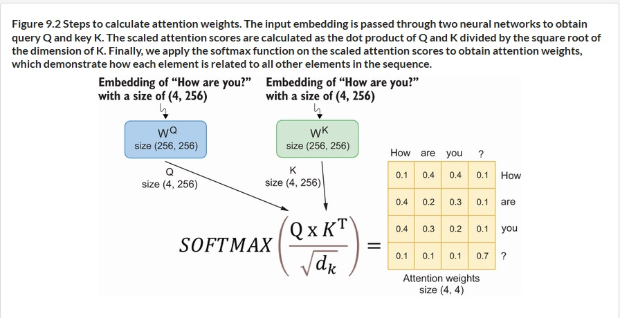
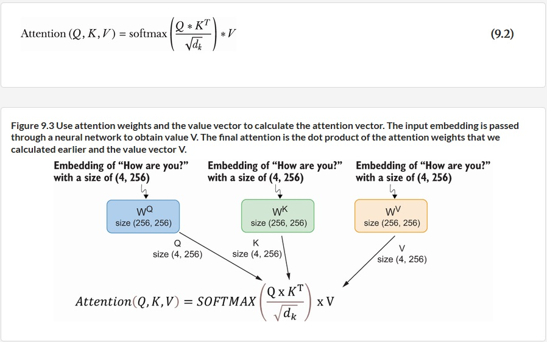
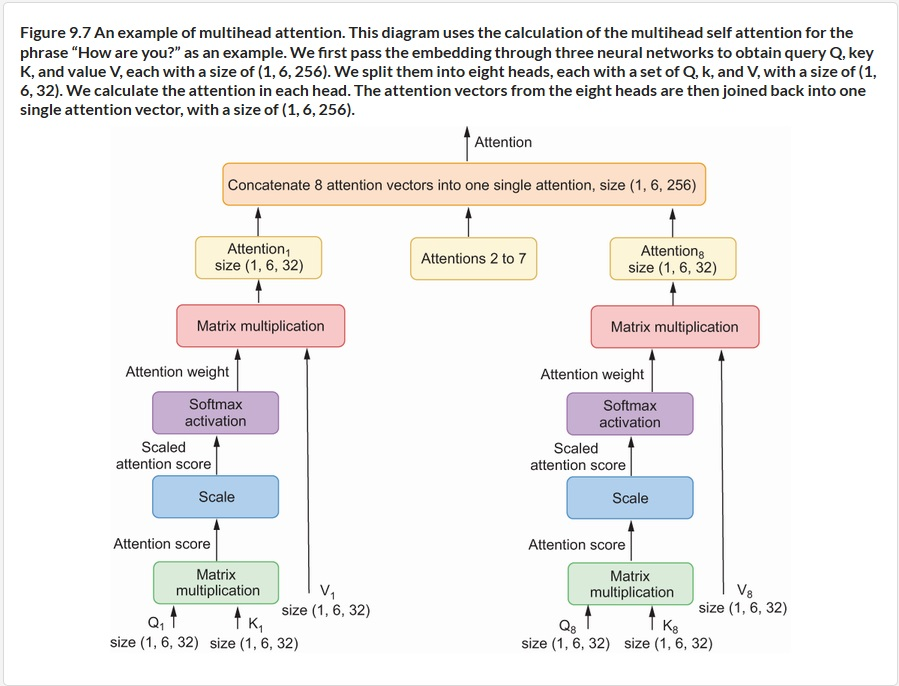
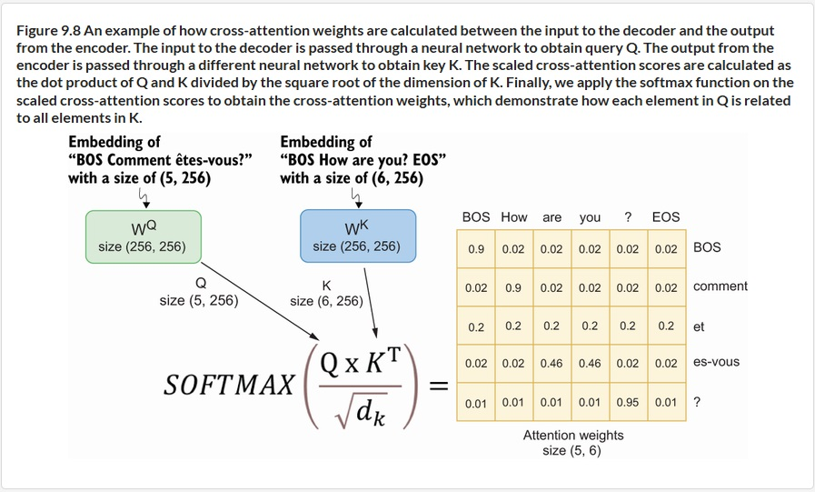

# 1. introduction
Transformers are deep learning models that excel in handling sequence-to-sequence prediction, outperforming older model like RNNs.

Transformer strength is effectively understanding the relationships between elements in input and output sequences over long distances. 

The central aspect of Transformer architecture is attention mechanism which assesses the relationship between words in a sequence by assigning weights, determining the degree of relatedness in meaning among owrds based on the training data. Transformers discern word meanings based on their surrounding context.

# 2. Architecture of Transformer


We will build a Transformer composed of an encoder and a decoder with self-attention to determine the interconnections between elements.

## 2.1 Word Embedding
The raw sentences are tokenized into subword tokens. Then the subword tokens would the index and further pass through the embedding layer to get vectors with continuous values. The dimensions of the vectors are comparsively smaller than one hot encoding vectors.

<u>example</u>: 
Let's say the English phrase "I do not speak French". The phase could be divided into 6 subword tokens which are ( ```i, do, not, speak, fr, ench``` ). If the word embedding layer is in a length of 256, the output matrix would then in ( 6, 256 ) dimension.

## 2.2 Position Encoding
Position encoding are unique vectors assigned to each position into input sequence and align with dimension with word embeddings. It uniquely identify each token position by a 256 length vector. The vector values are determined by specific position function which is defined by

`pos` represents the position of a token within the sequence
`i` represents the index of the word embedding vector

Each position encoding vector values remain constant throughout training.

<u>example</u>: 
Here go back to position encoding for the subword tokens ( ```i, do, not, speak, fr, ench``` ). `pos` range from 0 to 5. `i` ( `2i` for even number index and `2i+1` for odd number index ) with 256 distinct values (index from 0 to 255). The position encoding vectors would be in ( 6, 256 ) dimension. 

The position encoding vectors would then be added to word embedding vectors as input embedding vectors to encoder or decoder.
 
## 2.3 Encoder & Decoder
......
### 2.3.1 Encoder
Encoder is made up of 6 identical layers. Each layer consists of two distinct sublayers:
- **1st** : multihead self-attention layer + layer normalization + residual connection 
- **2nd** : position-wise feed forward layer + layer normalization + residual connection 


### 2.3.2 Decoder
Decoder is also made up of 6 identical layers but each layer consists of three distinct sublayers:
- **1st** : masked multihead self-attention layer (for decoder input) + layer normalization + residual connection 
- **2nd** : multihead self-attention layer (for output from encoder) + layer normalization + residual connection
- **3rd** : position-wise feed forward layer + layer normalization + residual connection


## 2.4 Attention Mechanism
......
### 2.4.1 Basic Attention Mechanism
The attention mechanism used is self-attention that includes `query` & `key` & `value` vectors. The the self-attention module would calculate **scaled dot product attention(SDPA)** .

To calculate SDPA score, the input embedding is passed through 3 neural layers with weights ( `Wq` & `Wk` & `Wv` ) respectively. The outputs are `query (Q)` & `key (K)` & `value (V)` vectors. The SDPA score is then obtained by `Q` & `K` & `V` vectors.

Let's think of a example of finding a book in public library. If I search for "machine learning in finance" in search engine, this phase would be `query (Q)`. The book titles and descriptions are `key (K)`. Then the seach engine would calculate the similarity between my seaching phase and books titles/descriptions in system.

The SDPA score would then be subjected to a softmax function that calculate **Attention Weight**. The softmax function ensures that the total attention a word giving to all words in the sequence are summed to 100%.

The weights ( `Wq` & `Wk` & `Wv` ) are in ( input embedding vectors length , input embedding vectors length ) dimension. And output `Q` & `K` & `V` vectors are in ( subword tokens length , input embedding vectors length ) dimension.




<u>example</u>:

The weights ( `Wq` & `Wk` & `Wv` ) are in ( 256, 256 ) while `Q` & `K` & `V` vectors are in ( 6, 256 ) dimensions.

### 2.4.2 Multihead Attention 
Multihead attention is on top of SDPA that split `query (Q)` & `key (K)` & `value (V)` vectors in different heads. Each head pays attention to different parts of input.

The 256 lenght `Q` & `K` & `V` vectors are splitted into 8 heads and each head with dimensions of 256/8 = 32.


### 2.4.3 Masked Multihead Attention
Masked Multihead attention could be found in **Decoder**, applying to attention score from decoder's input embedding vectors. The decoder mask words to the right to prevent decoder from seeing tokens in the future, force decoder looks at the tokens on the left.

### 2.4.4 Cross Attention
The Cross Attention is located on 2nd Sublayer of **Decoder** layer. The Cross Attention weights indicate the intercorrelation between <u>output from Encoder</u> and <u>output from 1st sublayer</u>. We obtain `query (Q)` & `value (V)` vectors from <u>output from Encoder</u> which denoted as `Xen` but obtain  `key (K)` vector from <u>output from 1st sublayer</u> which denoted as `Xde`.

<u>example</u>:

Let's say I have English phase ( `'BOS', 'how', 'are', 'you', '?', 'EOS'` ) with dimension ( 6, 256) as input of **Encoder**. And I going to predict next word of French phase ( `'BOS', 'comment', 'et', 'es-vous', '?'` ) with dimension ( 5, 256 ) as input of **Decoder**. In this example, `Xen` is in dimension ( 6, 256 ) and `Xde` is in dimension ( 5, 256 ). `K` is in dimension ( 5, 256 ). `V` & `Q` are in dimension ( 6, 256 ). The final output from 2nd sublayer is ( 5, 256 ).

